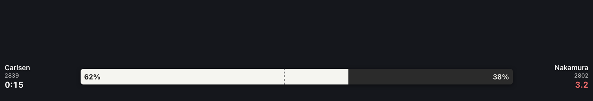

# chess-equity — streaming overlay (OBS browser source)

A transparent web overlay a streamer drops into OBS/Streamlabs as a **browser
source**. It renders a live, clock-aware **equity bar** — practical win chances
for each player — that updates as a broadcast game progresses, and visibly
diverges from the standard Stockfish centipawn bar viewers are used to.



*Above: a captured frame of the bundled replay. The practical equity bar gives
Carlsen 62% while the dashed **centipawn ghost tick** sits at ~48% (engine: dead
even) — Nakamura is down to 3.2s. The clock-aware bar tells the real story.*

This is task **0019** (the streamer-facing deliverable of the live-streaming
wedge). It is a self-contained front-end: it consumes a feed of events and draws
the bar. The live ingestion task (**0018**) produces that feed; the equity model
(**0005**) fills in the numbers. Until those land, a bundled **mock replay**
(`mock-game.json`) drives the overlay so it's demonstrable today.

## Quick start (under 2 minutes)

```bash
cd overlay
python3 serve.py            # stdlib only — no pip install
```

Then in OBS: **Sources → + → Browser**, and set the URL to one of:

| URL | Feed |
| --- | --- |
| `http://localhost:8777/`            | bundled replay (`mock-game.json`) |
| `http://localhost:8777/?src=/sse`   | **live** SSE push (replays `mock-game.json` over SSE) |

### Live feed from a real (or replayed) broadcast — task 0021

`serve.py` above replays the bundled mock over SSE. To drive the overlay from the
**actual broadcast ingestor** (task 0018) — a live Lichess round or a PGN replayed
move-by-move — start the bridge instead:

```bash
chess-equity broadcast --pgn game.pgn --serve            # replay a finished game as "live"
chess-equity broadcast --round <id> --serve --interval 2 # a live Lichess broadcast round
```

It serves the same overlay files **and** pushes the live equity stream at `/sse`,
translating the ingestor's `MoveEvent`s into this page's `game`/`position` schema (the
translation lives in `chess_equity.overlay`). Point OBS at
`http://localhost:8777/?src=/sse`. Equity numbers are the placeholder baseline until
Maia-2 (task 0005) lands; the wiring is unchanged when it does.

Set the source size to your scene (e.g. 1920×120 for a bottom strip) and tick
**"Shutdown source when not visible"** off so the feed keeps running. The page
background is transparent, so only the bar composites over your stream.

### Config (query params, all optional)

| Param | Default | Meaning |
| --- | --- | --- |
| `src`    | `./mock-game.json` | SSE endpoint, `ws[s]://` WebSocket, or a `.json` replay file |
| `layout` | `horizontal` | `horizontal` (names flank a wide bar) or `vertical` (classic eval-bar) |
| `theme`  | `dark` | `dark` or `light` label text |
| `cp`     | `1` | show the dashed **centipawn ghost tick** for contrast (`0` to hide) |
| `cpbar`  | `0` | render the centipawn eval as a **full second bar** (greyed, under the equity bar) instead of a tick |
| `caster` | `0` | **caster mode** — flare on big practical swings, highlighted when the engine bar misses them |
| `speed`  | `1` | replay speed multiplier for `.json` feeds |

Example: `http://localhost:8777/?src=/sse&layout=vertical&cp=0`
Caster setup: `http://localhost:8777/?caster=1&cpbar=1`

## What it shows

- The **equity bar** (0–100% practical), both names + ratings.
- Both **clocks** (turn red under 10s — the time pressure that drives the wedge).
- The last move's **Δequity grade** pill (task 0008) — flares green when a player
  finds better than their level expects, red on a blunder.
- A dashed **centipawn ghost tick** showing where the classic engine bar would
  sit — so the divergence is visible at a glance (or a **full second bar** with
  `?cpbar=1`).
- In **caster mode** (`?caster=1`), a **drama flare** on big practical equity
  swings, glowing gold when it's a swing the engine bar misses (e.g. a clock
  scramble the centipawn eval calls quiet) — the caster's "look at THIS" cue.

The bundled `mock-game.json` is a bullet time-scramble: around the time scramble
the centipawn eval reads ≈0.00 (or slightly for Black) while the clock-aware
equity bar shows White ~65–75% — then Black blunders under flag pressure and the
two bars converge. That divergence is asserted by `test_overlay.py`.

## Event schema (the contract 0018 must emit)

The feed is a sequence of JSON events. Over SSE/WebSocket, one JSON object per
message. As a replay file, an array (or `{ "events": [...] }`) where each event
may carry `delayMs` = milliseconds to wait before the next one.

All numbers are **White-POV**. `equity` is the practical win chance
`P(win) + 0.5·P(draw)` ∈ `[0,1]`; `cp` is the classic centipawn eval; `clock`
values are **seconds remaining**.

```jsonc
// one-time metadata
{
  "type": "game",
  "format": "bullet",                       // optional label
  "players": {
    "white": { "name": "Carlsen", "rating": 2839 },
    "black": { "name": "Nakamura", "rating": 2802 }
  }
}

// per-move update
{
  "type": "position",
  "ply": 44,
  "move": { "san": "Rxd5??" },              // optional, for display
  "equity": 0.88,                           // REQUIRED — White-POV practical win chance 0..1
  "cp": 60,                                 // optional — classic centipawn eval (White POV)
  "wdl": { "win": 0.80, "draw": 0.16, "loss": 0.04 },  // optional, if the model exposes WDL
  "clock": { "white": 13.2, "black": 1.6 }, // optional — seconds remaining
  "grade": { "label": "blunder", "delta": -0.22 },     // optional — Δequity grade (mover POV)
  "drama": { "kind": "scramble", "magnitude": 0.55,    // optional — caster-mode drama (task 0020)
             "headline": "Time scramble — Black (1.6s) swings the bar -22 pts" }
}
```

Only `type` and (for positions) `equity` are required; everything else degrades
gracefully (missing clock hides the clock, missing `cp` hides the ghost tick). The
optional `drama` payload mirrors `chess_equity.drama.DramaEvent` — when present it
supplies the caster-mode flare's headline; otherwise caster mode derives a flare
from the equity swing itself, so it works on any feed.

## Tests

```bash
python3 test_overlay.py        # or: pytest overlay/test_overlay.py
```

Validates the schema and asserts the headline acceptance criterion — that the
equity bar diverges from the centipawn bar by ≥20 points somewhere, and that the
fixture contains a real time-scramble.

## Deferred (follow-ups)

- ~~Wire to the real **0018** broadcast feed~~ — done (task 0021):
  `chess-equity broadcast --serve` pushes the live ingestor over `/sse`. Still
  deferred: surfacing **player names** in the `game` event (the bridge sends ratings
  only today), and a config page that takes a round/game URL (config is via query
  params for now).
- Emit the server-side `drama` payload from the pipeline (0018 + `chess_equity.drama`)
  so caster headlines use the full classifier (clutch / missed-win / escape / scramble)
  rather than the client-side swing heuristic.
- Precompute-then-live buffering for instant load (0012).
